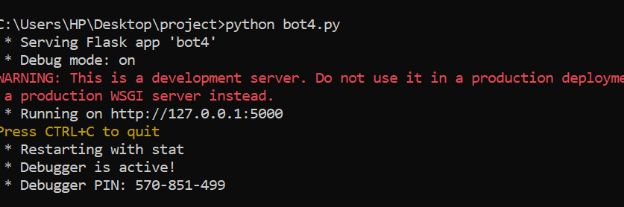

# wine-faq-chatbot
A Flask-based chatbot for a wine business that provides quick answers from a predefined FAQ corpus and directs users to contact the business for out-of-corpus queries. Features a minimalistic web interface and utilizes a pre-trained question-answering model.

# Project Overview
# This project involves creating a chatbot for a wine business to provide quick answers based on a given corpus, using a minimalistic UI. It directs users to contact the business directly for out-of-corpus questions.

# Files Included
bot4.py: Main Flask application code.
index2.html: HTML frontend for the chatbot interface.
generaye_s.py: Script to generate a secure secret key.

# Prerequisites
Python 3.7+
Flask
transformers
torch
difflib
re

# Installation Instructions
# Install Required Packages
In cmd run :
pip install flask transformers torch

# Prepare the JSON File
# Ensure that the QA.json file (Sample Question Answer file) with the question-answer pairs is located at the specified path in bot4.py. Update the path to where the file is located in your device
with open("update path here", 'r') as f:
    faqs = json.load(f)

# TO RUN , FIRST :
# RUN CMD AS ADMINISTRATOR, THEN  CHANGE THE PATH TO THE PATH WHERE THE project FOLDER 
# NOTE: RUN ALL THE FILES, WITH CMD AS ADMINISTRATOR ONLY
# THEN FIRST,

# Generate a Secret Key
# Run the generaye_s.py script to generate a secret key for securing the Flask session.
# in cmd run --> python generaye_s.py
# Copy the generated secret key.
# Then in the cmd 
# PASTE THE FOLLOWING COMMAND AND PASTE THE GENERATED KEY AS SHOWN BELOW
set FLASK_SECRET_KEY=<your_generated_secret_key>

# Running the Application
# Start the Flask Application
# The file is bot4.py
# In cmd run, python bot4.py
You will get something like this

# Now to Access the Chatbot Interface
# Open your web browser and navigate to http://127.0.0.1:5000/., --> copy from cmd

# Usage
Type a message in the input field and press "Send".
The chatbot will respond based on the FAQ.
Special phrases like "hello", "thanks", and "bye" will trigger appropriate responses.
Notes
Ensure that the required packages are installed and the environment variables are correctly set.
The index2.html file provides the frontend interface. Make sure it is correctly referenced in bot4.py.
